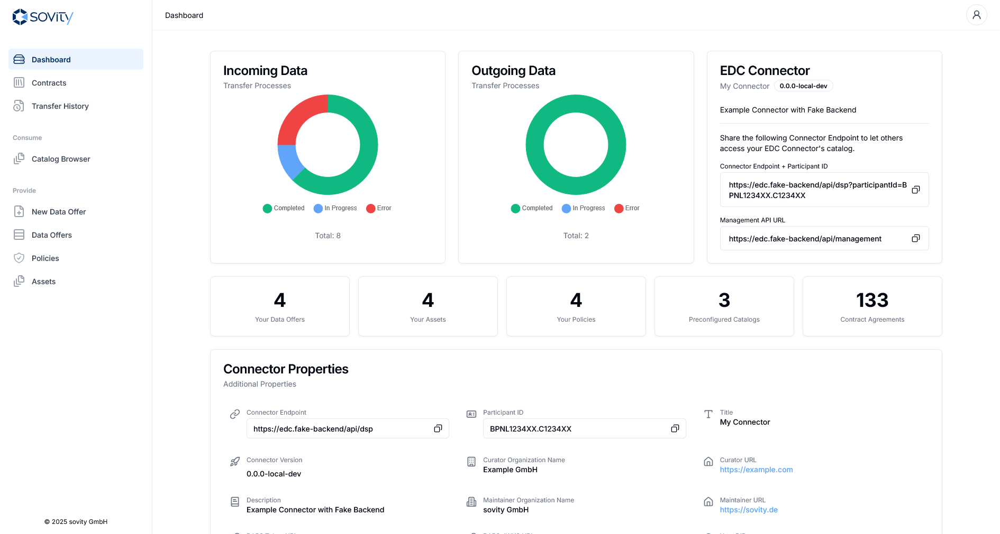
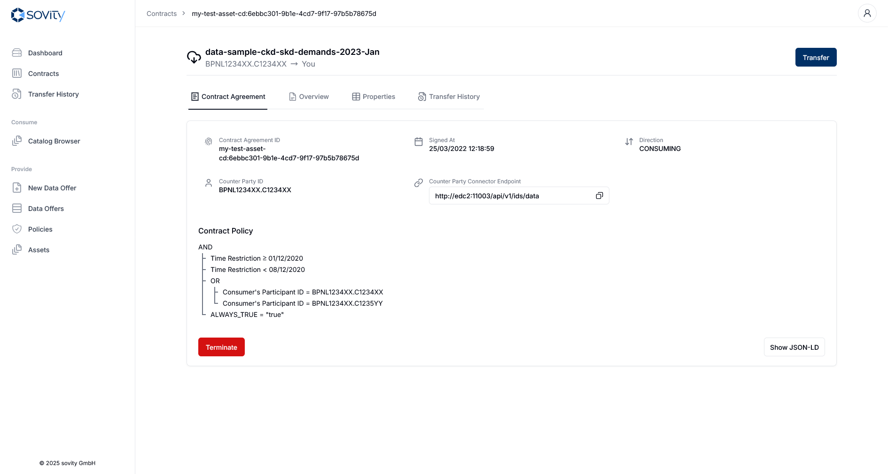
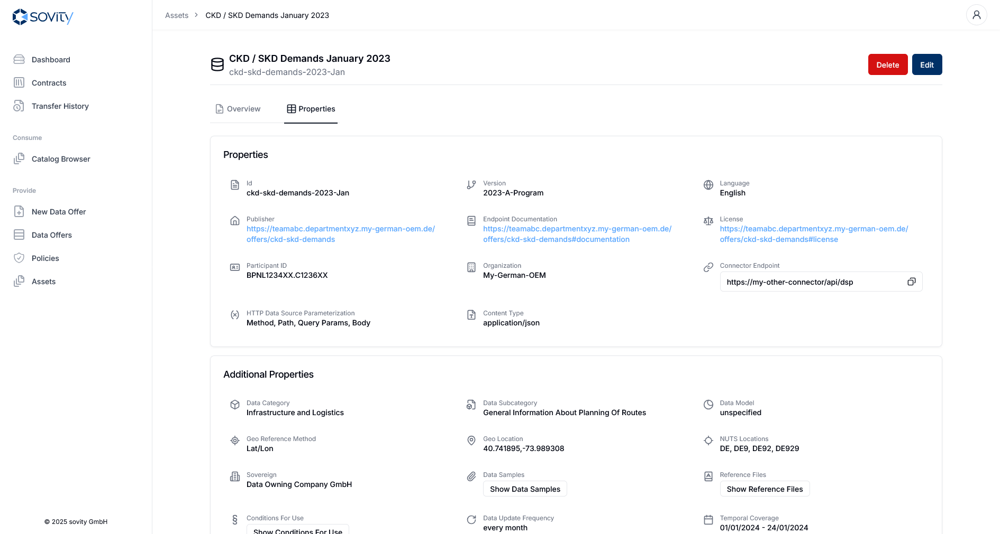

<a name="readme-top"></a>

[![Contributors][contributors-shield]][contributors-url]
[![Forks][forks-shield]][forks-url] [![Stargazers][stars-shield]][stars-url]
[![Issues][issues-shield]][issues-url]
[![Apache 2.0][license-shield]][license-url]
[![LinkedIn][linkedin-shield]][linkedin-url]

<br />
<div align="center">
<a href="https://github.com/sovity/edc-ce">

</a>

<h3 align="center">sovity Community Edition EDC</h3>
<p align="center" style="padding-bottom:16px">
Extended EDC Connector by sovity.
<br />
<a href="https://github.com/sovity/edc-ce/issues/new?template=bug_report.md">Report Bug</a>
·
<a href="https://github.com/sovity/edc-ce/issues/new?template=feature_request.md">Request Feature</a>
</p>
</div>

<details>
   <summary>Table of Contents</summary>
   <ol>
      <li><a href="#about-the-project">About The Project</a></li>
      <li><a href="#getting-started">Getting Started</a></li>
      <li><a href="#compatibility">Compatibility</a></li>
      <li><a href="#contributing">Contributing</a></li>
      <li><a href="#license">License</a></li>
      <li><a href="#contact">Contact</a></li>
   </ol>
</details>

## About The Project

[Eclipse Dataspace Components](https://github.com/eclipse-edc) (EDC) is a framework
for building dataspaces, exchanging data securely with ensured data sovereignty.

[sovity](https://sovity.de/) extends the EDC Connector's functionality with extensions to offer
enterprise-ready managed services like "Connector-as-a-Service", out-of-the-box fully configured DAPS
and integrations to existing other dataspace technologies.

This repository contains our sovity Community Edition EDCs, providing a self-hostable sovity EDC Connector.

Check out our [Getting Started Section](#getting-started) on how to run a local sovity Community Edition EDC.

<p align="right">(<a href="#readme-top">back to top</a>)</p>

<div>
  
  
  
</div>

## Getting Started

The fastest way to get started is our [Getting Started Guide](docs/getting-started/README.md).

<p align="right">(<a href="#readme-top">back to top</a>)</p>

## Compatibility

Our sovity Community Edition EDC is compatible with productive Tractus-X versions. We stay in sync with the Eclipse EDC that Tractus-X is using.

Some parallel versions might be maintained, although done as sparingly as possible.

Each sovity Enterprise Edition EDC release also releases a sovity Community Edition with the same
version ensuring same version usage and naming across API Clients, Connector and Connector UI.

<p align="right">(<a href="#readme-top">back to top</a>)</p>

## Contributing

Contributions are what make the open source community such an amazing place to
learn, inspire, and create. Any contributions you make are **greatly
appreciated**.

If you have a suggestion that would improve this project, feel free to open
a [feature request](https://github.com/sovity/edc-ce/issues/new?template=feature_request.md). Don't forget to
leave the project a ⭐, if you like the effort put into this version!

Our contribution guideline can be found in [CONTRIBUTING.md](CONTRIBUTING.md).

<p align="right">(<a href="#readme-top">back to top</a>)</p>

## Development

Please note that our sovity Community Edition EDC gets automatically released with our
sovity Enterprise Edition EDC. Because of this, most of the tooling and development processes are not public,
such as our E2E Test suite and most of our JUnit Integration tests are not present here.

#### Requirements

- Docker Environment
- JDK 17
- GitHub Maven Registry Access
- Node 20

To access the GitHub Maven Registry you need to provide the following properties, e.g. by providing
a `~/.gradle/gradle.properties`.

```properties
gpr.user={your github username}
gpr.key={your github pat with packages.read}
```

### Local Development: Backend

The backend can be developed fully using tests.

<p align="right">(<a href="#readme-top">back to top</a>)</p>

#### Local Development: Frontend

As soon as the API model is ready the
[Fake Backend](frontend/src/lib/api/fake-backend/edc-fake-backend.ts)
can be developed. The fake backend is mostly type-safe by using the generated API model classes and mappers.

To launch the frontend dev server with the Fake Backend, run:

```shell script
# Bash, Git Bash or WSL

# Install dependencies (only required once)
(cd frontend && yarn)

# Run the dev server with Fake Backend (Local Development)
# Also regenerates the API Client Library
(cd frontend && yarn cold-start)

# Run the dev server with Fake Backend (Local Development)
# Does not regenerate the API Client Library
(cd frontend && yarn start)


# Run a fully-compiled demo version with Fake Backend (Local Development)
(cd frontend && yarn start-demo)
```

This starts the frontend at http://localhost:3000

The configuration can be found in [frontend/.env.local-dev](frontend/.env.local-dev).

<p align="right">(<a href="#readme-top">back to top</a>)</p>

## License

Distributed under the `LICENSE`. Some deliverables such as APIs, API Clients and Utility Libraries remain under the `Apache License 2.0`. See [LICENSE](LICENSE) for more information.

<p align="right">(<a href="#readme-top">back to top</a>)</p>

## Contact

contact@sovity.de

<p align="right">(<a href="#readme-top">back to top</a>)</p>


[contributors-shield]:
https://img.shields.io/github/contributors/sovity/edc-ce.svg?style=for-the-badge

[contributors-url]: https://github.com/sovity/edc-ce/graphs/contributors

[forks-shield]:
https://img.shields.io/github/forks/sovity/edc-ce.svg?style=for-the-badge

[forks-url]: https://github.com/sovity/edc-ce/network/members

[stars-shield]:
https://img.shields.io/github/stars/sovity/edc-ce.svg?style=for-the-badge

[stars-url]: https://github.com/sovity/edc-ce/stargazers

[issues-shield]:
https://img.shields.io/github/issues/sovity/edc-ce.svg?style=for-the-badge

[issues-url]: https://github.com/sovity/edc-ce/issues

[license-shield]:
https://img.shields.io/github/license/sovity/edc-ce.svg?style=for-the-badge

[license-url]: https://github.com/sovity/edc-ce/blob/main/LICENSE

[linkedin-shield]:
https://img.shields.io/badge/-LinkedIn-black.svg?style=for-the-badge&logo=linkedin&colorB=555

[linkedin-url]: https://www.linkedin.com/company/sovity
