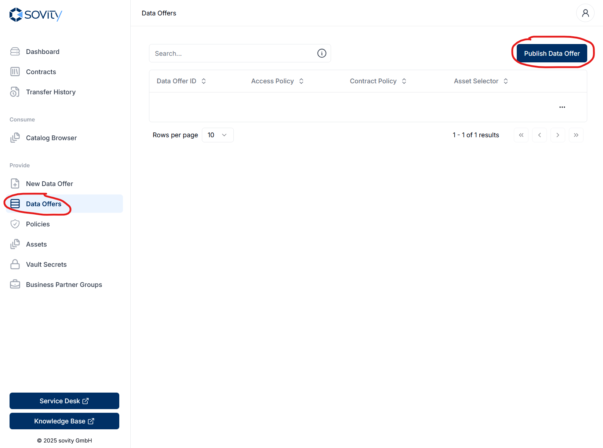
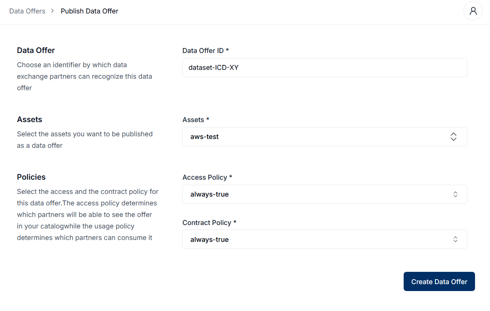
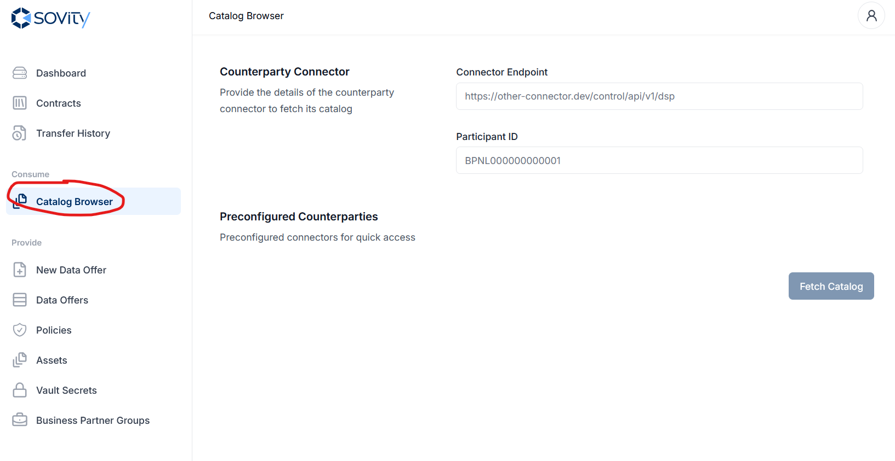
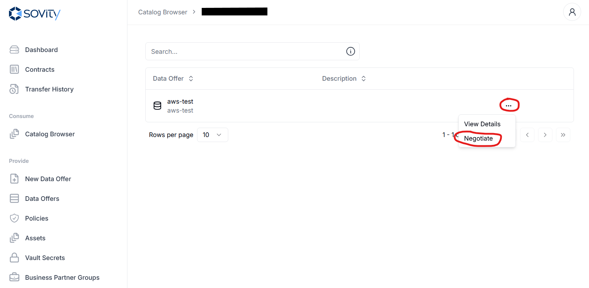
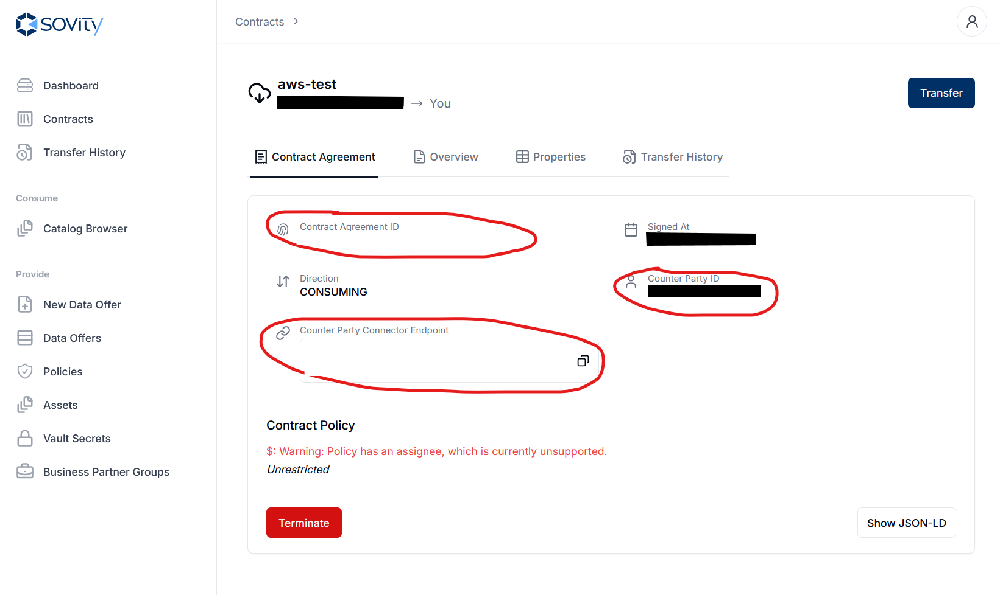

# AWS S3 Transfer

**AWS Setup:** To enable access to an AWS S3 bucket, follow these steps:

1. Create an `IAM User`
   - Navigate to `IAM` > `Users` > `Add User`
   - Assign the necessary permissions to allow access to the S3 bucket
   - A broad permission example: `AmazonS3FullAccess`

2. Create an `Access Key`
   - Go to the IAM user details page
   - Select the `Security credentials` tab
   - Generate an `Access Key`: `Thirdparty-Service`


## Create an EDC Asset with AWS S3 datasource

### Requirements
- AWS S3 bucket with some file
- AWS S3 access key and secret key

### Create the EDC Asset
The EDC asset can be created using a `POST` request to the `/v3/assets` endpoint of the EDC Management API with the following body:
```json
{
  "@context": {
    "@vocab": "https://w3id.org/edc/v0.0.1/ns/"
  },
  "properties": {
    "description": "description",
    "id": "{{NEW_ASSET_ID}}"
  },
  "dataAddress": {
    "@type": "DataAddress",
    "type": "AmazonS3",
    "region": "{{SOURCE_S3_BUCKET_REGION}}",
    "bucketName": "{{SOURCE_S3_BUCKET_NAME}}",
    "objectName": "{{PATH_TO_FILE_IN_SOURCE_S3_BUCKET}}",
    "accessKeyId": "{{AWS_ACCESS_KEY}}",
    "secretAccessKey": "{{AWS_SECRET_KEY}}"
  }
}
```

### Publish an EDC Data Offer
Once the asset is created, you can publish a data offer with this asset either using the sovity EDC UI or the Management API. The following steps walk you through the EDC UI:

Go to the EDC UI, navigate to "Data Offers" and click "Publish Data Offer".


Publish the Data Offer by selecting the newly created asset and the correct policies.



## Consuming a data offer with AWS S3

### Requirements
- DSP endpoint of counterparty connector
- Participant ID (BPN) of counterparty connector
- Asset ID of the asset
- Access to your EDC's Management API


### Step 1: Get Contract Agreement ID

Before starting a transfer, you need to successfully negotiate a contract for a data offer. This will give you a Contract Agreement ID.

You can do this either [using the sovity EDC-UI](#step-1a-use-edc-ui) or [using the Management API](#step-1b-use-management-api).

#### Step 1a: Use EDC-UI

Go to the sovity EDC-UI of your EDC.

Navigate to the Catalog Browser and put in the DSP-Endpoint and Participant ID (BPN) of the counterparty EDC:


Find the data offer and negotiate a contract. Follow the steps until the contract is successfully negotiated:


You should get redirected to the Contract Details page, where the Contract Agreement ID will be displayed:



#### Step 1b: Use Management API
##### Request Catalog
- Send `POST` request to the `/v3/catalog/request` endpoint of the Management API with the following body:
```json
{
    "@context": {
       "@vocab": "https://w3id.org/edc/v0.0.1/ns/"
    },
    "@type": "CatalogRequest",
    "counterPartyAddress": "{{COUNTERPARTY_DSP}}",
    "counterPartyId": "{{COUNTERPARTY_BPN}}",
    "protocol": "dataspace-protocol-http",
    "querySpec": {
        "filterExpression": {
            "operandLeft": "id",
            "operator": "=",
            "operandRight": "{{ASSET_ID}}"
        }
    }
}
```
- Copy the Data Offer ID from the `odrl:hasPolicy` -> `@id` field to the placeholder `OFFER_ID` in the next request
  - It should look something like this: `dGVzdC1kZg==:dGVzdC1kZg==:MDE5ZGRlZjItZmVlNy03MDExLTgzZDAtZTY1Nzk1MDQwNDQw`
- Copy the values for the `odrl:permission`, `odrl:prohibition` and `odrl:obligation` fields to the next request


##### Negotiate a contract
- Send `POST` request to the `/v3/contractnegotiations` endpoint of the Management API with the following body:
```json
{
    "@context": {
        "@vocab": "https://w3id.org/edc/v0.0.1/ns/"
    },
    "@type": "ContractRequest",
    "counterPartyAddress": "{{COUNTERPARTY_DSP}}",
    "protocol": "dataspace-protocol-http",
    "policy": {
        "@context": "http://www.w3.org/ns/odrl.jsonld",
        "@type": "odrl:Offer",
        "@id": "{{OFFER_ID}}",
        "assigner": "{{COUNTERPARTY_BPN}}",
        "target": "{{ASSET_ID}}",
        "odrl:permission": ["<<Fill with copied value>>"],
        "odrl:prohibition": ["<<Fill with copied value>>"],
        "odrl:obligation": ["<<Fill with copied value>>"]
    }
}
```

##### Check if negotiation was successful
- Send `GET` request to the `/v3/contractnegotiations/{{CONTRACT_NEGOTIATION_ID}}/state` endpoint of the Management API
```sh
curl --request GET \
  --url {{EDC_MANAGEMENT_URL}}/v3/contractnegotiations/{{CONTRACT_NEGOTIATION_ID}}/state \
```
- If the state is `TERMINATED`, the negotiation failed
- If the state is `FINALIZED`, the negotiation was successful


##### Get Contract Agreement ID
- Send `GET` request to the `/v3/contractnegotiations/{{CONTRACT_NEGOTIATION_ID}}/agreement` endpoint of the Management API
```sh
curl --request GET \
  --url {{EDC_MANAGEMENT_URL}}/v3/contractnegotiations/{{CONTRACT_NEGOTIATION_ID}}/agreement \
```
- Extract Contract Agreement ID from `@id` field in response


### Step 2: Start transfer to your S3 bucket
- Send `POST` request to the `/v3/transferprocesses` endpoint of the Management API with the following body:
```json
{
    "@context": {
        "@vocab": "https://w3id.org/edc/v0.0.1/ns/"
    },
    "@type": "TransferRequest",
    "protocol": "dataspace-protocol-http",
    "counterPartyAddress": "{{COUNTERPARTY_DSP}}",
    "connectorId": "{{COUNTERPARTY_BPN}}",
    "assetId": "{{ASSET_ID}}",
    "dataDestination": {
        "@type": "DataAddress",
        "type": "AmazonS3",
        "properties": {
            "region": "{{DESTINATION_S3_BUCKET_REGION}}",
            "bucketName": "{{DESTINATION_S3_BUCKET_NAME}}",
            "objectName": "{{PATH_TO_FILE_IN_DESTINATION_S3_BUCKET}}",
            "accessKeyId": "{{AWS_ACCESS_KEY}}",
            "secretAccessKey": "{{AWS_SECRET_KEY}}"
        }
    },
    "contractId": "{{CONTRACT_AGREEMENT_ID}}",
    "transferType": "AmazonS3-PUSH"
}
```
