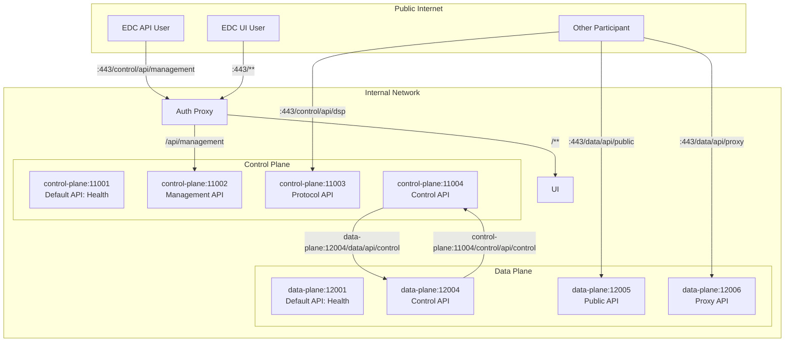

## Deployment Goal: Production: Control Plane + Data Plane (Standalone)

### Deployment Units

| Deployment Unit                                              | Version / Details                                                           |
|--------------------------------------------------------------|-----------------------------------------------------------------------------|
| Reverse Proxy that merges the UI+CP+DP and removes the ports | (deployment specific)                                                       |
| Hashicorp Vault (Optional)                                   | -                                                                           |
| Auth Proxy                                                   | Used for UI + Management API Access from the Browser                        |
| Control Plane PostgreSQL DB                                  | see [CHANGELOG.md](../../../../CHANGELOG.md) for compatible version         |
| Control Plane                                                | see [CHANGELOG.md](../../../../CHANGELOG.md) for the backend docker image.  |
| Data Plane                                                   | see [CHANGELOG.md](../../../../CHANGELOG.md) for the backend docker image.  |
| Data Plane PostgreSQL DB                                     | see [CHANGELOG.md](../../../../CHANGELOG.md) for compatible version         |
| Connector UI                                                 | see [CHANGELOG.md](../../../../CHANGELOG.md) for the frontend docker image. |

### Port and Path Mapping

In general:

- The Connector is meant to be deployed with a reverse proxy merging multiple ports / paths.
- All endpoints should be secured by TLS/HTTPS.
- The following assumes configured base path `/control` for the Control Plane and `/data` for the Data Plane.
- Standalone Control Plane:
  - Assuming a base path `/control`
  - Assuming default first port of `11000`
  - Management API URL for API users:
    - `https://${MY_EDC_FQDN}/control/api/management` -> `control-plane:11002/control/api/management`
  - Management API URL for UI users. Use this route for the UI to access the Management API via the Auth Proxy's Cookie:
    - `https://${MY_EDC_FQDN}/ui/api/management` -> **[Auth Proxy]** -> `control-plane:11002/control/api/management`
  - Protocol API URL
    - `https://${MY_EDC_FQDN}/control/api/dsp` -> `control-plane:11003/control/api/dsp`
- Standalone Data Plane:
  - Assuming a base path `/data`
  - Assuming default first port of `12000` for standalone data planes
  - Data Plane Public API URL:
    - `https://${MY_EDC_FQDN}/data/api/public` -> `data-plane:12005/data/api/public`
  - Proxy API (originally only for Catena-X):
    - `https://${MY_EDC_FQDN}/data/api/proxy` -> `data-plane:12006/data/api/proxy
- UI:
  - `https://${MY_EDC_FQDN}/**` -> **[Auth Proxy]** -> `connector-ui:8080`

Here's a mermaid diagram visualizing the setup:

### Control Plane / Data Plane

#### Configuration: Control Plane / Data Plane

Both the control plane and the data plane use the same docker image. Please choose the approprate deployment kind and the
running image will act as the standalone control plane / standalone data plane.

Please see our auto-generated [sovity EDC CE Connector Config](../../config/connector-ce/README.md) documentation and exhaustively
check out all "Important" / "Optional" configuration options.

Also note required vault secrets and potential special environment variables available for our docker image.

#### Debugging in Production

The Connector Backend can be configured via environment variables to be remote debugged.
See the [sovity EDC CE Connector Config](../../config/connector-ce/README.md) documentation for more information.

#### Using the same DB for the Control Plane and Data Plane

This is not possible. If you want to save resources, feel free to use the alternative setup [Control Plane with integrated Data Plane](cp-with-integrated-dp.md),
that requires only one backend EDC and one DB.

### Connector Frontend

#### Configuration: Connector Frontend

Please see our [sovity EDC CE Connector UI Config](../../../deployment-guide/config/connector-ui/README.md) documentation.

### Health Checks

| Container          | Base URL                           | Available Endpoints                                                                      |
|--------------------|------------------------------------|------------------------------------------------------------------------------------------|
| Connector Frontend | http://localhost:8080              | Docker Container already has a HEALTHCHECK.   Check for `GET /` 200 + non-empty body. |
| Control Plane      | http://localhost:11001/control/api | [edc-health-api.yaml](../../../api/edc-health-api.yaml)                                  |
| Data Plane         | http://localhost:12001/data/api    | [edc-health-api.yaml](../../../api/edc-health-api.yaml)                                  |
