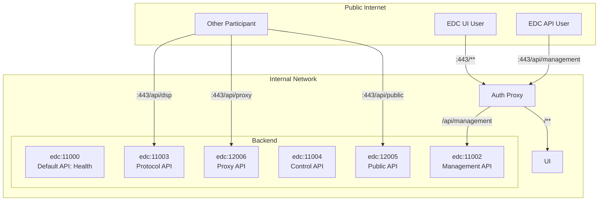

## Deployment Goal: Production: Control Plane with Integrated Data Plane

### Deployment Units

| Deployment Unit                                              | Version / Details                                                           |
|--------------------------------------------------------------|-----------------------------------------------------------------------------|
| Reverse Proxy that merges the UI+CP+DP and removes the ports | (deployment specific)                                                       |
| Hashicorp Vault (Optional)                                   | -                                                                           |
| Auth Proxy                                                   | Used for UI + Management API Access from the Browser                        |
| Connector Postgresql DB                                      | see [CHANGELOG.md](../../../../CHANGELOG.md) for  compatible version        |
| Connector Backend                                            | see [CHANGELOG.md](../../../../CHANGELOG.md) for the backend docker image.  |
| Connector UI                                                 | see [CHANGELOG.md](../../../../CHANGELOG.md) for the frontend docker image. |

### Port and Path Mapping

In general:

- The Connector is meant to be deployed with a reverse proxy merging multiple ports / paths.
- All endpoints should be secured by TLS/HTTPS.
- The following assumes no configured base path.
- Connector Backend:
  - Assuming default first port of `11000`
  - Management API URL for API users:
    - `https://${MY_EDC_FQDN}/api/management` -> `edc:11002/api/management`
  - Management API URL for UI users. Use this route for the UI to access the Management API via the Auth Proxy's Cookie:
    - `https://${MY_EDC_FQDN}/ui/api/management` -> **[Auth Proxy]** -> `edc:11002/api/management`
  - Protocol API URL
    - `https://${MY_EDC_FQDN}/api/dsp` -> `edc:11003/api/dsp`
  - Data Plane Public API URL:
    - `https://${MY_EDC_FQDN}/api/public` -> `edc:11005/api/public`
  - Proxy API (originally only for Catena-X):
    - `https://${MY_EDC_FQDN}/api/proxy` -> `edc:11006/api/proxy`
- UI:
  - `https://${MY_EDC_FQDN}/**` -> **[Auth Proxy]** -> `connector-ui:8080`

Here's a mermaid diagram visualizing the setup:

### Connector Backend

#### Configuration: Connector Backend

Please choose the appropriate deployment kind and our EDC Backend Image can act as a control plane with an integrated data plane.

Please see our auto-generated [sovity EDC CE Connector Config](../../config/connector-ce/README.md) documentation and exhaustively
check out all "Important" / "Optional" configuration options.

Also note required vault secrets and potential special environment variables available for our docker image.

#### Debugging in Production

The Connector Backend can be configured via environment variables to be remote debugged.
See the [sovity EDC CE Connector Config](../../config/connector-ce/README.md) documentation for more information.

### Connector Frontend

#### Configuration: Connector Frontend

Please see our [sovity EDC CE Connector UI Config](../../../deployment-guide/config/connector-ui/README.md) documentation.

### Health Checks

| Container          | Base URL                   | Available Endpoints                                                                      |
|--------------------|----------------------------|------------------------------------------------------------------------------------------|
| Connector Frontend | http://localhost:8080      | Docker Container already has a HEALTHCHECK.   Check for `GET /` 200 + non-empty body. |
| Connector Backend  | http://localhost:11001/api | [edc-health-api.yaml](../../../api/edc-health-api.yaml)                                  |
