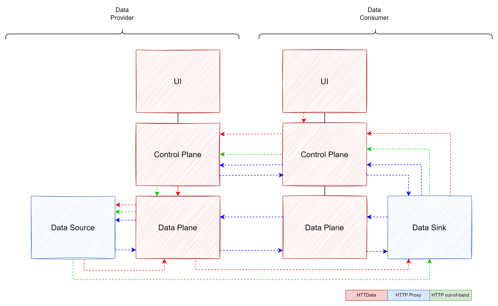

Supported Transfer Modes
========

The connector supports two different data transfer modes:

1. HTTPData: The provider EDC fetches the data from the responsible data source and pushes the data to the consumer's desired data sink. The transfer flow is either initiated by the consumer using the EDC-UI or from a consumer backend via API calls, which could be a use case application and could also serve as a data sink (a1). This triggers an initiation for sending a transfer-request from the consumer control plane and the request is send towards the control plane of the provider. With this call (a2) the access credentials of the consumers data sink and its URL together with other necessary information are handed over to the provider. After successfully checking the context, e.g. that the requesting consumer is eligible to request the data, the provider control plane orchestrates a call to a provider data plane to process the transfer request further (a3). The provider data plane fetches the data from the responsible data source, as defined in the asset data-address and any additional parameterizations, with a REST call (a4) and caches the data (a5), to finally transfer the data to the desired consumer data sink (a6).
2. HTTPProxy: The provider EDC fetches the data and passes it on consumer's data transfer request synchronously back to the consumer.

The following diagram illustrates the different transmission modes:

# Consuming Data via HttpProxy / HTTP Pull
The Use-Case Backend-Application is involved in steps b1, b4, b5 and b8 of the diagram. It should provide an endpoint for receiving
the EDR (b4). These information can then be used to start the tranfser request (b5). The result of the transfer request
will contain the data (b8).
