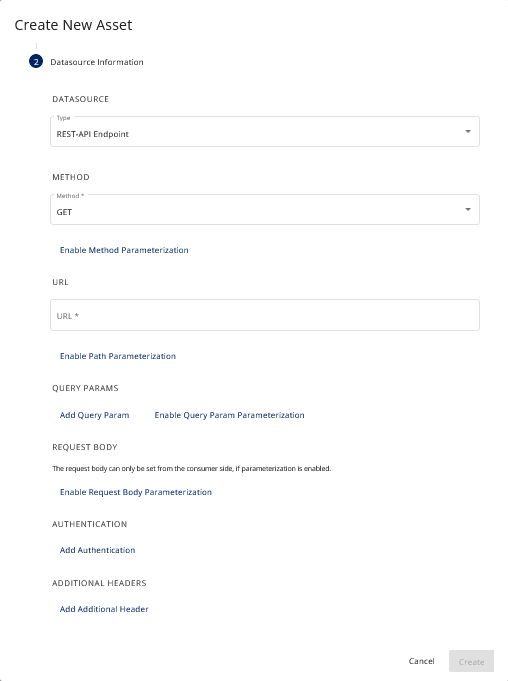

# Parameterized Assets Guide

This guide will help you understand how to set up and use HTTP Data assets in our system.

## What are Parameterized Assets?

These are HTTP Data assets where you can change certain settings, or "parameters".

## Settings You Can Change

when you're choosing a HTTP Data asset in the user interface (UI), there are options you can turn on or off to let you
change certain parts of the HTTP request. These are called "overridable" fields because you can change, or "override,"
the default settings. Here's what each option does:

### Method Overridability:
When you're using an asset and you've enabled "Method Overridability," you're required to specify a "Custom HTTP Method."

A "method" is a type of request you make to a server. Common examples include GET (asking a server to show you a webpage), POST (sending information to a server, like filling out a form), PUT (updating information on a server), and DELETE (asking a server to remove information). So, when "Method Overridability" is enabled, you need to tell the system which of these types of requests to make to the server. This specified request type is your "Custom HTTP Method."

### Path Overridability:
When "Path Overridability" is turned on, you have the ability to append additional paths to the URL specified by the provider. The path is the part of the URL that comes after the domain name. However, keep in mind that you're not replacing the entire path provided by the URL, but just adding to it at the end.

### Query Parameter Overridability:
When "Query Parameter Overridability" is enabled, you can add or modify parameters in your HTTP request's URL. This is particularly useful when you need to customize your request. Simply put, the system will merge the default parameters of the HTTP Data asset and the ones you provide. In case of any conflicts, your parameters will have the upper hand. For example, if the default parameter is 'color=blue' and you provide 'color=red', your 'color' preference 'red' will be used.

### Request Body Overridability:
When "Request Body Overridability" is enabled, you can alter the data you're sending to the server in the request body. This comes in handy when you're using methods like POST or PUT to send new data or update existing ones. If this feature is turned on, you can replace the default request body data, that comes with the HTTP Data asset, with your own. However, if it's not turned on, the system will use the default request body and you won't be able to modify it.

#### Rules to Follow

- For methods like GET, HEAD, DELETE, OPTIONS, and others, you can't have a request body.
- For methods like POST, PUT, PATCH, you must have a request body.
- If you break these rules or forget to choose a method, the process will finish, but no data will be sent.

# Understanding Parameter Validation and Its Limitations

When you're using our HTTP Data asset with parameterization enabled, it's important to understand how parameter validation works and some of the limitations you might encounter.

## Known Issues with Invalid Parameters:

Our HTTP Data asset validates your parameters when making a request. However, if your parameters are invalid, you may encounter issues. A notable example is the system reporting a complete data transfer even when no data has been exchanged. This happens because the validation checks parameters at the data plane stage, not at the control plane stage.

## Missing Method Issues

This can also happen if you don't provide a method for your request, even though you've turned on method overridability. Without a method, your request can't be completed correctly, but the system might not catch this issue because of the validation limitations mentioned above.

## About Asset Properties

Our parameterization process creates special "asset properties" that let you know what kind of parameterization is enabled for your HTTP Data asset. However, these properties aren't currently shown in the user interface.

This means that to know which parameterization is enabled for your asset, you'll need to note it down manually.

