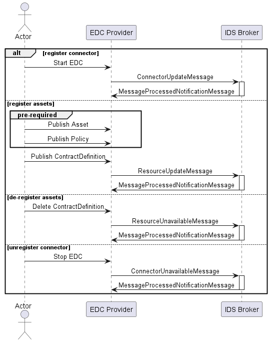

<!-- PROJECT LOGO -->
<br />
<div align="center">
  <a href="https://github.com/sovity/edc-extensions">
    
  </a>

<h3 align="center">EDC-Connector Extension:<br />Broker Client Extension</h3>

  <p align="center">
    <a href="https://github.com/sovity/edc-extensions/issues/new?template=bug_report.md">Report Bug</a>
    ·
    <a href="https://github.com/sovity/edc-extensions/issues/new?template=feature_request.md">Request Feature</a>
  </p>
</div>

## About this Extension

This extension communicates changes in connector status and contract definitions to
an [IDS Broker](https://catalog.test.mobility-dataspace.eu/).

It registers / unregisters each EDC Connector on startup / shutdown. It also communicates all contract definition to the
Broker on creation / deletion. It does not communicate contract definitions created with restrictive policies such as
connector restrictions.

## Why does this extension exist?

A centralized catalog has many advantages like:

- Have a look at available data assets, offered in a data space, before joining the data space as a participant
- See what data are offered by other participants, instead of fetching data catalogs manually

## Getting Started

Our MDS Community Edition EDC is built with both the clearing house and broker extensions and is ready to
be used in the Mobility Data Space (MDS).

## Sequence Diagram

[broker-extension.puml](docs/broker-extension.puml)



### Supported Asset Properties

The Broker Extension supports the following additional meta information to be sent to the broker:

- id: 'asset:prop:id'
- name: 'asset:prop:name'
- contentType: 'asset:prop:contenttype'
- description: 'asset:prop:description'
- version: 'asset:prop:version'
- keywords: 'asset:prop:keywords'
- language: 'asset:prop:language'
- publisher: 'asset:prop:publisher'
- standardLicense: 'asset:prop:standardLicense'
- endpointDocumentation: 'asset:prop:endpointDocumentation'

MDS-specific properties:

- dataCategory: 'http://w3id.org/mds#dataCategory'
- dataSubcategory: 'http://w3id.org/mds#dataSubcategory'
- dataModel: 'http://w3id.org/mds#dataModel'
- geoReferenceMethod: 'http://w3id.org/mds#geoReferenceMethod'
- transportMode: 'http://w3id.org/mds#transportMode'

## Configuration

The Broker URL can be configured with the ENV var:

```dotenv
EDC_BROKER_BASE_URL=https://broker.test.mobility-dataspace.eu
```

To disable the extension (per default enabled) you can use following ENV var:

```
BROKER_CLIENT_EXTENSION_ENABLED=false
```

## License

Apache License 2.0 - see [LICENSE](../../LICENSE)

## Contact

sovity GmbH - contact@sovity.de
