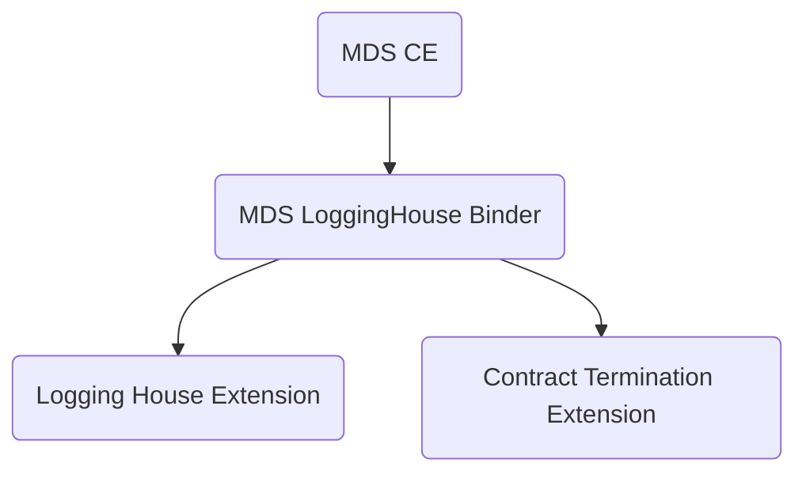

<!-- PROJECT LOGO -->
 

  

<h3 align="center">EDC-Connector Extension: MDS Contract Termination - LoggingHouse binder</h3>

  

    <a href="https://github.com/sovity/edc-ce/issues/new?template=bug_report.md">Report Bug</a>
    ·
    <a href="https://github.com/sovity/edc-ce/issues/new?template=feature_request.md">Request Feature</a>
  

## About this Extension

It links the Contract Termination events with the LoggingHouse. 

## Why does this extension exist?

MDS needs to log the events generated when terminating a contract with their Logging House extension.
The Logging House is an external dependency and the linkage must only happen for the MDS variant.

This extension implements this specific task.

## Architecture

## License

Apache License 2.0 - see [LICENSE](../../LICENSE)

## Contact

sovity GmbH - contact@sovity.de
