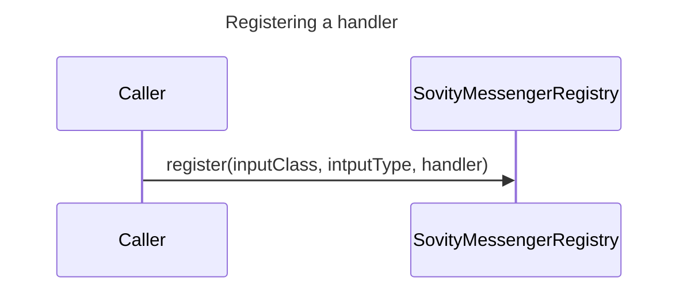
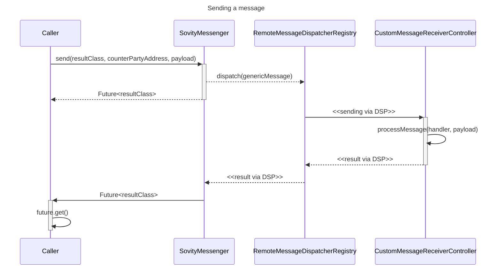

<!-- PROJECT LOGO -->
 

  

<h3 align="center">EDC-Connector Extension: Sovity Messenger</h3>

  

    <a href="https://github.com/sovity/edc-extensions/issues/new?template=bug_report.md">Report Bug</a>
    ·
    <a href="https://github.com/sovity/edc-extensions/issues/new?template=feature_request.md">Request Feature</a>
  

## About this Extension

To provide a simpler way to exchange messages between EDCs while re-using the Dataspace's Connector-to-Connector authentication mechanisms, we created our own extension with a much simpler API surface omitting JSON-LD.

## Why does this extension exist?

Adding custom DSP messages to a vanilla EDC is verbose and requires the handling of JSON-LD and implementing your own Transformers. Since we do not care about JSON-LD we wanted a simpler API surface.

## Architecture

The sovity Messenger is implemented on top of the DSP messaging protocol and re-uses its exchange and authentication.

It is abstracted from the internals of the DSP protocol such that changing the underlying implementation remains an option.

## Demo

You can find a demo project in [sovity-messenger-demo](../../demo/sovity-messenger-demo).

The 2 key entry points are:

- Register your message receiving by talking to the SovityMessageRegistry as demonstrated [here](..%2F..%2Fdemo%2Fsovity-messenger-demo%2Fsrc%2Fmain%2Fjava%2Fde%2Fsovity%2Fedc%2Fextension%2Fsovitymessenger%2Fdemo%2FSovityMessengerDemo.java).
- Send messages by calling the SovityMessenger as shown [here](..%2F..%2Fdemo%2Fsovity-messenger-demo%2Fsrc%2Ftest%2Fjava%2Fde%2Fsovity%2Fedc%2Fextension%2Fsovitymessenger%2Fdemo%2FSovityMessengerDemoTest.java)

## License

Apache License 2.0 - see [LICENSE](../../LICENSE)

## Contact

sovity GmbH - contact@sovity.de
